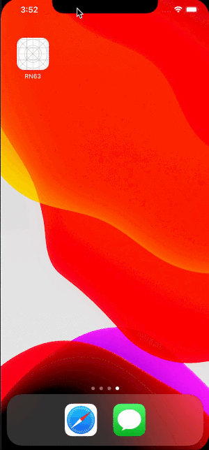
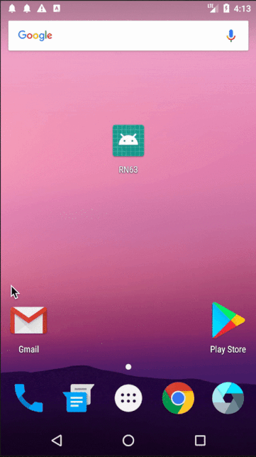

# @nghinv/react-native-splash-screen

A smart splash screen for React Native apps, written in JS, oc and java for cross-platform support.
It works on iOS and Android.

## Preview

 


## Installation

* Use yarn

```
yarn add @nghinv/react-native-splash-screen@1.0.0
```

* Use npm

```
npm install @nghinv/react-native-splash-screen@1.0.0 --save
```

## Installation (iOS)

- With RN >= 0.60 run `cd ios && pod install`

- With RN < 0.60 run `react-native link @nghinv/react-native-splash-screen`

* delete your project's LaunchScreen.xib

* Drag `SplashScreenResource` folder to your project *if you want change image, replace splash.png or add a image with your custom name*

* In AppDelegate.m

```c
...

#import "RCTSplashScreen.h" //import interface

...

RCTRootView *rootView = [[RCTRootView alloc] initWithBundleURL:jsCodeLocation moduleName:@"ReactNativeComponents" initialProperties:nil launchOptions:launchOptions];

// activate splashscreen, imagename from LaunchScreen.xib and LaunchScreen_iPad.xib
if(UI_USER_INTERFACE_IDIOM() == UIUserInterfaceIdiomPad) {
  [RCTSplashScreen open:rootView withImageNamed:@"splash_ipad"];
} else {
  [RCTSplashScreen open:rootView withImageNamed:@"splash"];
}

rootView.backgroundColor = [[UIColor alloc] initWithRed:1.0f green:1.0f blue:1.0f alpha:1];

self.window = [[UIWindow alloc] initWithFrame:[UIScreen mainScreen].bounds];
UIViewController *rootViewController = [UIViewController new];
rootViewController.view = rootView;
self.window.rootViewController = rootViewController;
[self.window makeKeyAndVisible];
return YES;

```

## Installation (Android)

- Auto link with RN >= 0.60

- Run `react-native link @nghinv/react-native-splash-screen` with RN <0.60

* Add your own `drawable/splash.png` to `android/app/src/main/res/`, it is recommended to add `drawable-?dpi` folders that you need.

  * drawable-hdpi
  * drawable-mdpi
  * drawable-xhdpi
  * drawable-xxhdpi
  * drawable-xxxhdpi

  For tablet:
  * drawable-large-hdpi
  * drawable-large-mdpi
  * drawable-large-xhdpi
  * drawable-large-xxhdpi

* in MainActivity.java

```java
...
import android.os.Bundle;
import com.reactnativecomponent.splashscreen.RCTSplashScreen; //import RCTSplashScreen
...
@Override
protected void onCreate(Bundle savedInstanceState) {
    RCTSplashScreen.openSplashScreen(this); //open splashscreen
    super.onCreate(savedInstanceState);
}
```

* In `android/app/**/styles.xml`

```xml
...
<!-- Base application theme. -->
<style name="AppTheme" parent="Theme.AppCompat.Light.NoActionBar">
    <!-- Customize your theme here. -->
    <item name="android:windowIsTranslucent">true</item>
</style>
...
```

## Usage

```js
...
import SplashScreen from '@nghinv/react-native-splash-screen';
...
componentDidMount () {
  SplashScreen.close({
    animationType: SplashScreen.animationType.scale,
    duration: 850,
    delay: 500,
  })
}
...
```

## Method

* close(animationType, duration, delay) close splash screen with custom animation

  * animationType: determine the type of animation. enum(animationType.none, animationType.fade, animationType.scale)
  * duration: determine the duration of animation
  * delay: determine the delay of animation
